# Encrypted File Sharing — Cryptography Architecture

## Overview

This system provides end-to-end encrypted file sharing inspired by Firefox Send's architecture. All cryptographic operations happen client-side — the server never sees plaintext data, passwords, or decryption keys. The frontend is a thin wrapper around Rust crypto compiled to WebAssembly, ensuring identical algorithms across all platforms.

**Core properties:**
- Zero-knowledge: server stores only ciphertext
- Password optional: random 32-byte IKM or password-derived keys
- Integrity: every encrypted chunk is authenticated via GCM
- Parallel: chunk-level encryption/decryption via Rayon (Rust) or worker pool (browser)
- Deterministic nonces: chunk index → unique nonce per chunk

```mermaid
graph LR
    A[Plaintext Files] --> B[7z Compression]
    B --> C[Split into 64 KB Chunks]
    C --> D[AES-256-GCM Encrypt]
    D --> E[Upload Ciphertext]
    E --> F[Share URL + Secret]
    F --> G[Download Ciphertext]
    G --> H[AES-256-GCM Decrypt]
    H --> I[Reassemble Chunks]
    I --> J[7z Decompress]
    J --> K[Plaintext Files]
```

## Algorithm Inventory

| Component | Algorithm | Purpose | Key Size | Mode |
|---|---|---|---|---|
| Key derivation | Argon2id | Password/memory-hard hashing | 32B output | V0x13 |
| Key expansion | HKDF-SHA256 | Domain-separated subkey derivation | 32B output | Extract-Expand |
| Metadata encryption | ChaCha20-Poly1305 | Authenticated metadata protection | 256-bit | AEAD |
| **Content encryption** | **AES-256-GCM** | **Authenticated bulk data encryption** | **256-bit** | **GCM** |
| Signatures | Ed25519 | Data authenticity | 256-bit seed | Pure EdDSA |
| **Nonce derivation** | **XOR-based** | **Per-chunk deterministic nonce** | **12B** | **XOR seq** |

---

## 1. Key Derivation

### Pipeline: Password/IKM → Master Key → Subkeys

Raw input (either a user password or a random 32-byte IKM) passes through two stages:

1. **Argon2id** — memory-hard key stretching
2. **HKDF-SHA256** — key normalization/expansion

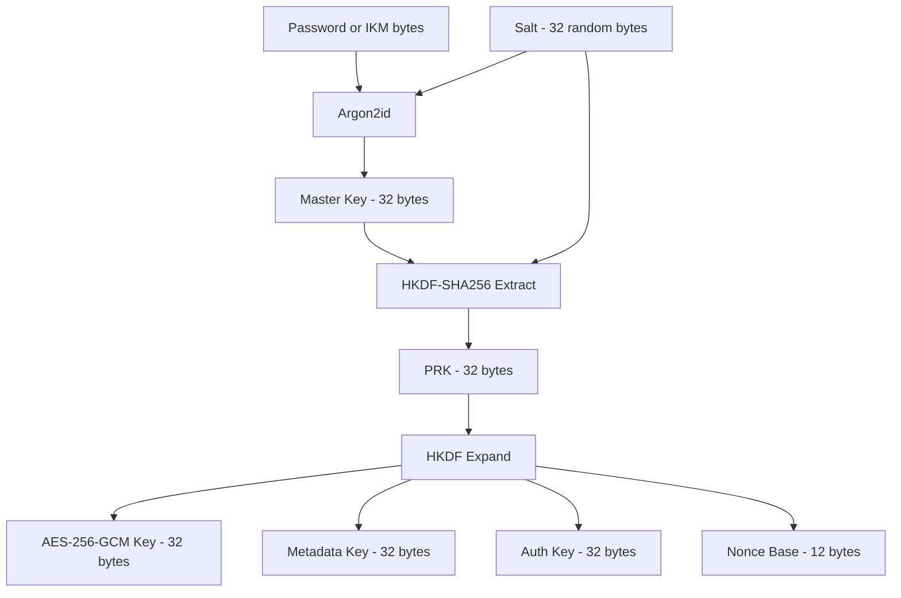

### Argon2id Parameters

| Parameter | Value | Rationale |
|---|---|---|
| Algorithm | Argon2id | Hybrid data-dependent/memory-hard resists both side-channel and GPU attacks |
| Version | V0x13 | Stable, widely-audited |
| Memory | 64 KiB | Lightweight for client-side/WASM operation |
| Iterations | **8** | Balanced for WASM speed + brute-force resistance |
| Parallelism | 1 | Single-thread for WASM compatibility |
| Output length | 32 bytes | Feeds HKDF directly |

### Argon2id Internals

Argon2id combines the resistance properties of Argon2i (side-channel resistance) and Argon2d (GPU/jumbo-hash resistance):

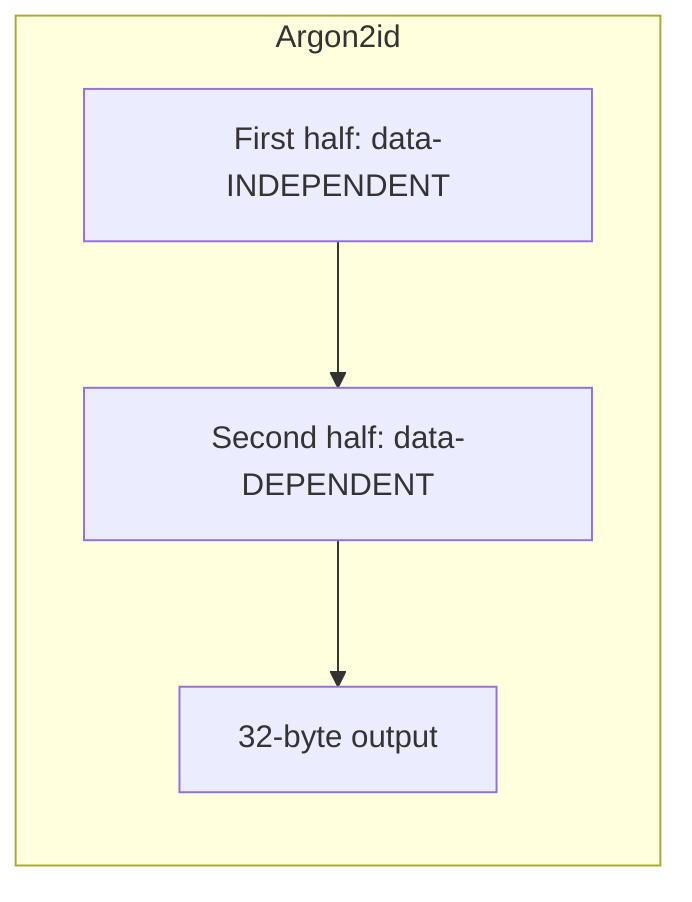

- **First half** passes use data-independent indexing (like Argon2i) — prevents timing attacks that profile which memory locations are accessed
- **Second half** passes use data-dependent indexing (like Argon2d) — prevents an attacker from computing different memory lanes in parallel

### Argon2id in WASM

The Argon2id implementation is compiled from Rust to WASM via `chithi_core.js`. The frontend calls `argon2DeriveWasm(password, salt, iterations, memoryCostKiB, hashLength)` which invokes the Rust function through `wasm-bindgen`:

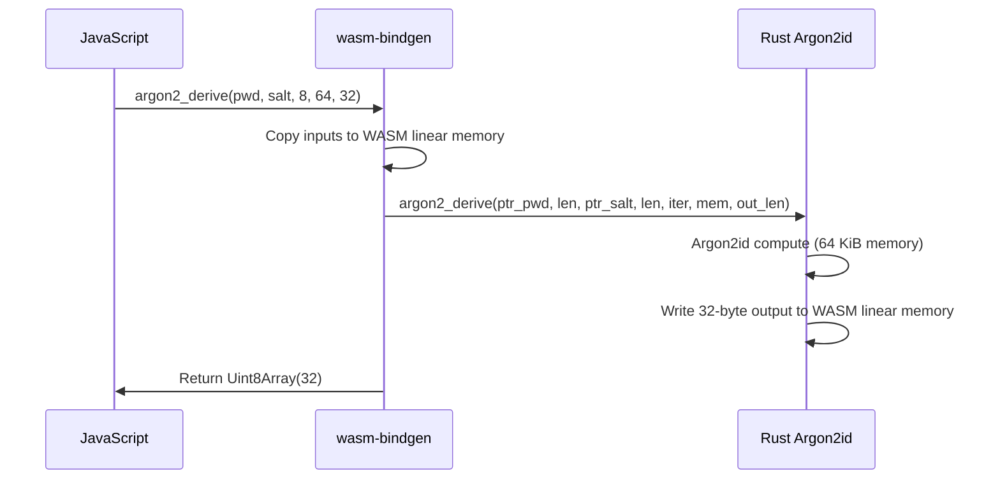

### HKDF-SHA256

The HKDF takes the Argon2id output and expands it into a usable key:

```rust
// Extract phase: produces a uniform PRK even if Argon2id output has bias
let (prk, hkdf_instance) = Hkdf::<Sha256>::extract(Some(salt), &argon2_key);

// Expand phase: derives the final 32-byte key
hkdf_instance.expand(&[], &mut okm)?;
```

**Two-phase design:**
- **Extract**: `PRK = HMAC-SHA256(salt, IKM)` — distills entropy into a fixed-length pseudorandom key
- **Expand**: `OKM = HMAC-SHA256(PRK, info || 0x01)` — expands to desired length with domain separation

The `info` parameter is empty here because the single 32-byte key is assigned to multiple roles structurally (the `Keychain` uses the same byte array for encryption, signing seed, and auth).

---

## 2. ChaCha20-Poly1305 (Metadata Encryption)

### Why ChaCha20 over AES for metadata

Metadata payloads are small (<10 KB) and structure is simple. ChaCha20-Poly1305 offers:
- **Software-speed**: full-speed integer arithmetic, no AES-NI dependency
- **Built-in authentication**: Poly1305 MAC prevents ciphertext tampering
- **No padding needed**: stream cipher operates on arbitrary lengths
- **WASM-friendly**: no platform-specific instruction set requirements

### ChaCha20 Quarter-Round

The core primitive is the quarter-round function, which operates on four 32-bit words:

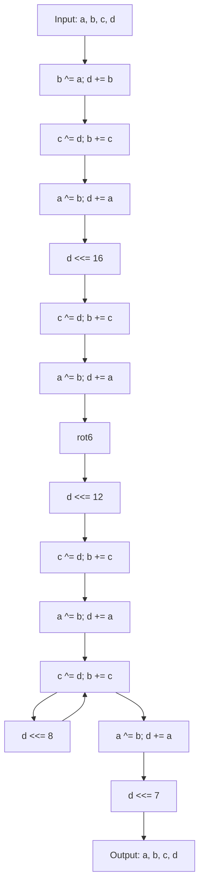

Each quarter-round mixes four state words through:
1. **Add**: modular 32-bit addition
2. **XOR**: bitwise exclusive-or
3. **Rotate**: left rotation by fixed amounts (16, 12, 8, 7)

### ChaCha20 Block Generation

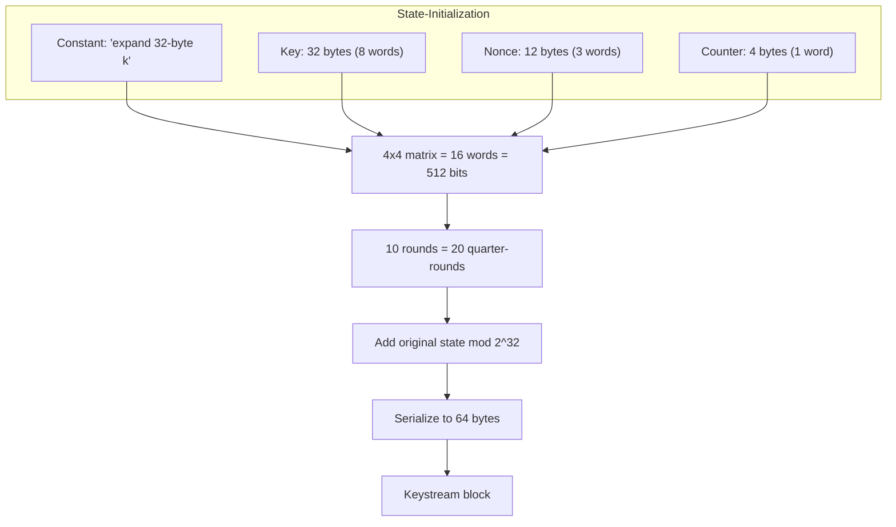

**Structure:**
- 4 constant words: `0x61707865, 0x3320646e, 0x79622d32, 0x6b206574` ("expand 32-byte k")
- 8 key words
- 1 counter word
- 3 nonce words (96-bit / 12-byte nonce)

**20 rounds** = 10 column rounds + 10 diagonal rounds of quarter-rounds. The output is added back to the initial state (Feistel-like property ensures invertibility).

### Poly1305 MAC

After ChaCha20 encryption, Poly1305 computes a 16-byte authentication tag:

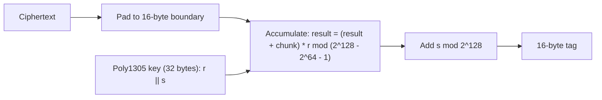

**Security guarantee:** Even if the attacker can choose messages, the probability of forging a valid tag is bounded by `(n+1)(n+2)/2^128` where `n` is the number of messages.

### Encryption Flow

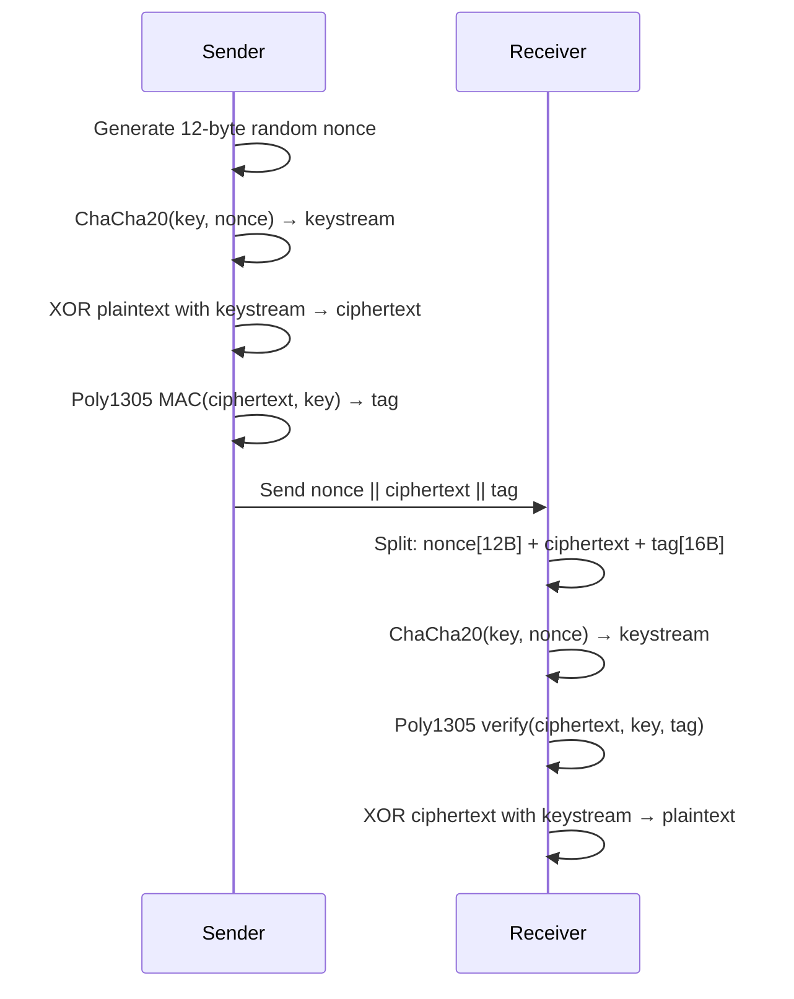

**On-the-wire format:** `nonce (12 bytes) || ciphertext (variable) || poly1305 tag (16 bytes)`

---

## 3. AES-256-GCM (Content Encryption)

### Why AES-GCM over AES-CBC

The system migrated from AES-256-CBC to AES-256-GCM to gain authenticated encryption:

| Property | AES-256-CBC | AES-256-GCM |
|---|---|---|
| Confidentiality | Yes | Yes |
| Integrity | **No** (bit-flip attacks) | **Yes** (16-byte auth tag) |
| Padding | PKCS7 required | **None needed** |
| Parallel decrypt | No (sequential unpad) | **Yes** (independent chunks) |
| WASM performance | AES-NI dependent | AES-NI + GHASH |

GCM combines:
- **CTR mode** for confidentiality (counter-based keystream, like ChaCha20)
- **GHASH** for authenticity (polynomial MAC over ciphertext + AAD)

### AES S-Box

The core non-linearity of AES is the S-Box, which computes multiplicative inverses in GF(2^8) followed by an affine transformation:

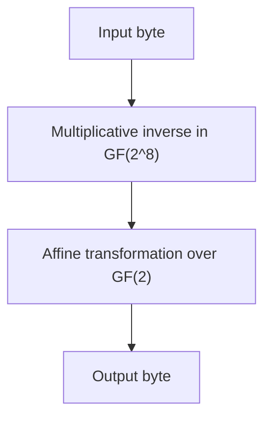

Each byte `b` is treated as a polynomial in GF(2^8) with irreducible polynomial `x^8 + x^4 + x^3 + x + 1`. The inverse of `0x00` is defined as `0x00`.

### GCM Mode

GCM operates in two phases:

#### Phase 1: Counter Mode Encryption

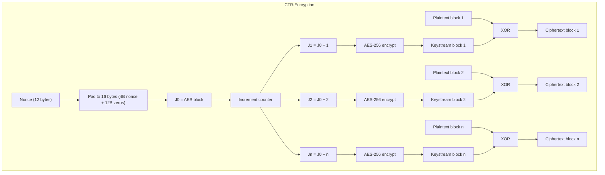

**CTR mode properties:**
- Each plaintext block is XORed with an AES-encrypted counter value
- Counter increments by 1 for each block
- **Naturally parallelizable**: all counter values known in advance
- **No padding needed**: last block is truncated to fit remaining data

#### Phase 2: GHASH Authentication

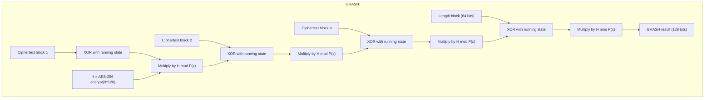

The GHASH function computes a polynomial MAC over the ciphertext blocks in the finite field GF(2^128) with irreducible polynomial `P(x) = x^128 + x^127 + x^126 + x^125 + x^121 + 1`.

#### Phase 3: Tag Generation

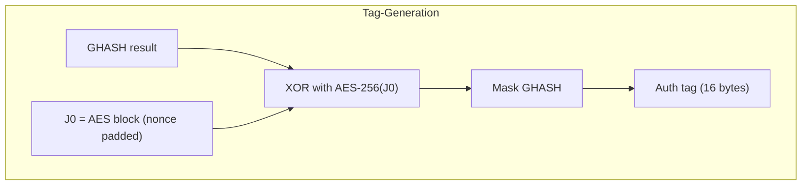

The auth tag is the XOR of GHASH output with the encryption of J0 (the initial counter block). This ensures the tag cannot be predicted without the key.

### Per-Chunk Nonce Derivation

Each chunk gets a unique nonce derived from a base IV plus the chunk index:

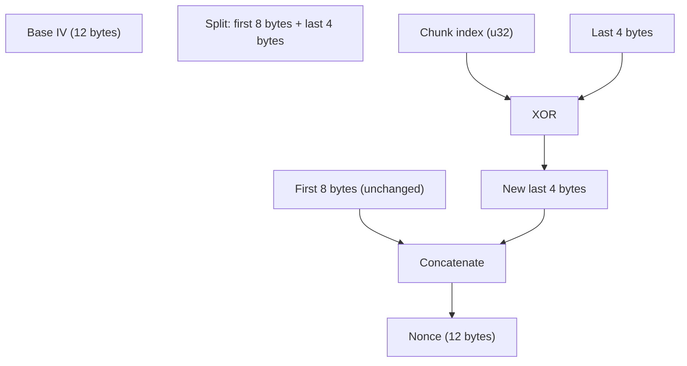

**Algorithm:**
```
nonce[0..8]  = base_iv[0..8]       // first 8 bytes unchanged
nonce[8..12] = base_iv[8..12] XOR chunk_index  // last 4 bytes XOR with index
```

This ensures:
- **Deterministic**: same chunk index always produces same nonce
- **Unique per chunk**: different indices yield different nonces
- **No counter state needed**: nonce is computed directly from index
- **Safe for parallelism**: all nonces derivable independently

### Chunk Encryption

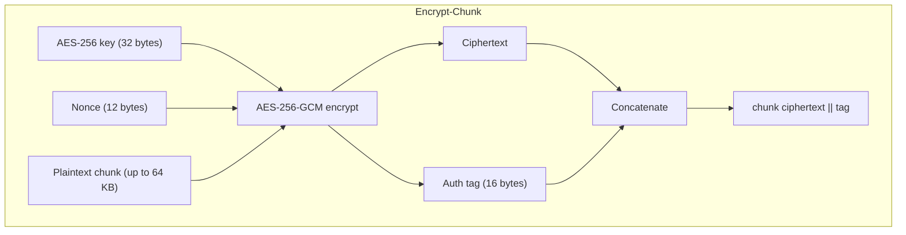

**On-the-wire format per chunk:** `ciphertext (variable) || GCM tag (16 bytes)`

### Chunk Decryption

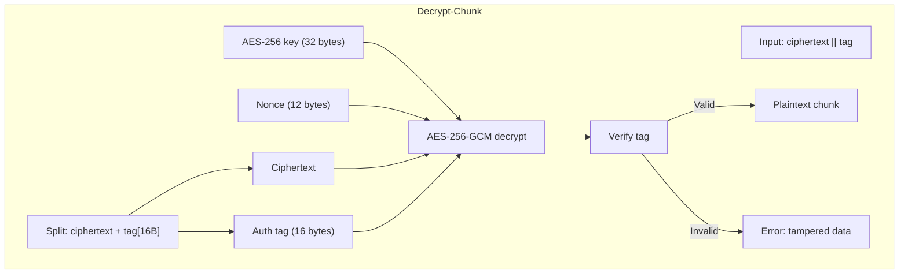

### Parallel Encryption with Rayon

Since each chunk uses an independent nonce (derived from chunk index), encryption order is deterministic but execution is parallel:

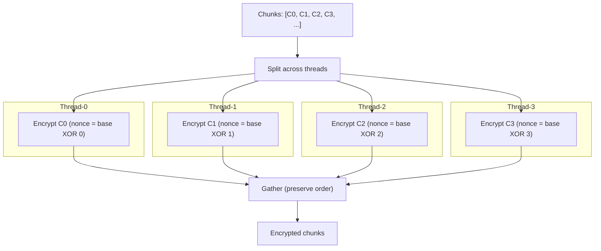

Rayon's `par_iter().enumerate().map()` distributes chunks across threads. The enumeration ensures output order matches input order regardless of thread scheduling.

### CBC Legacy Functions

The Rust core retains AES-256-CBC encrypt/decrypt functions for backward compatibility:

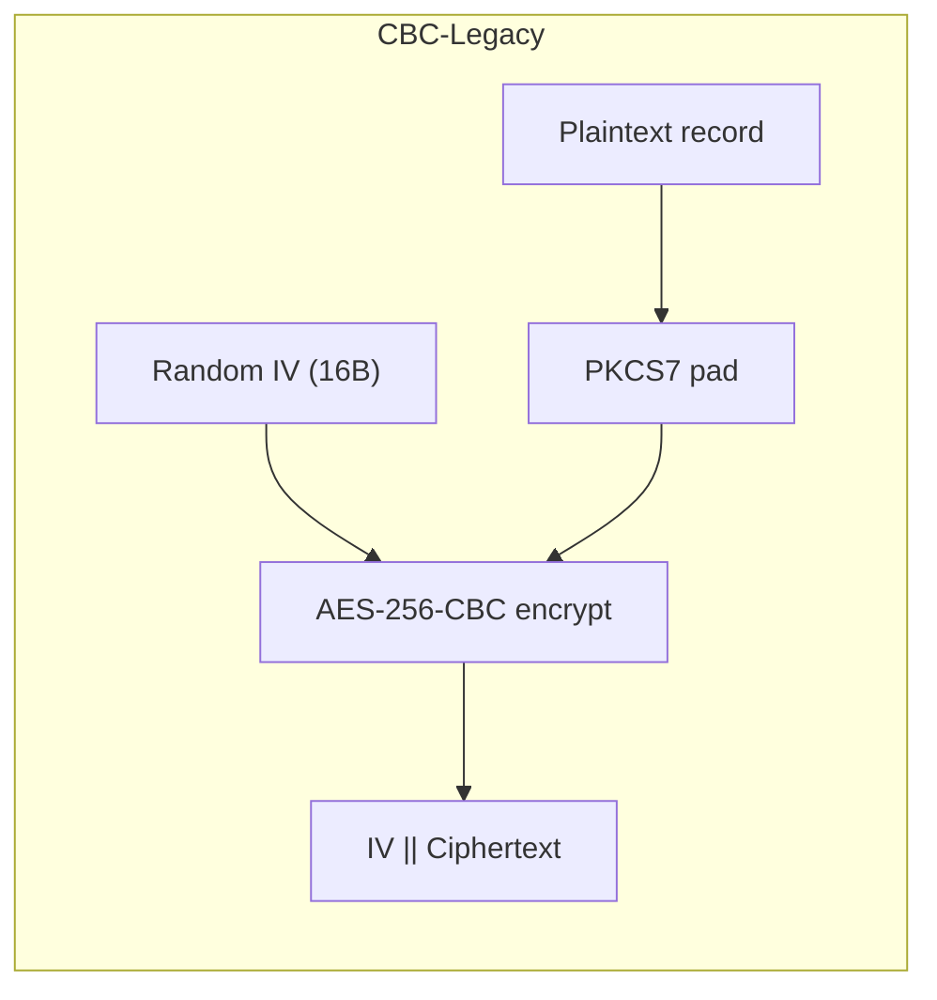

These are **deprecated** and scheduled for removal. All new code should use AES-256-GCM.

---

## 4. Ed25519 Signatures

### Curve: Curve25519

Ed25519 uses the twisted Edwards curve:
```
-x^2 + y^2 = 1 + d·x^2·y^2
```
where `d = -(121665/121666)` in the field GF(2^255 - 19).

### Key Generation

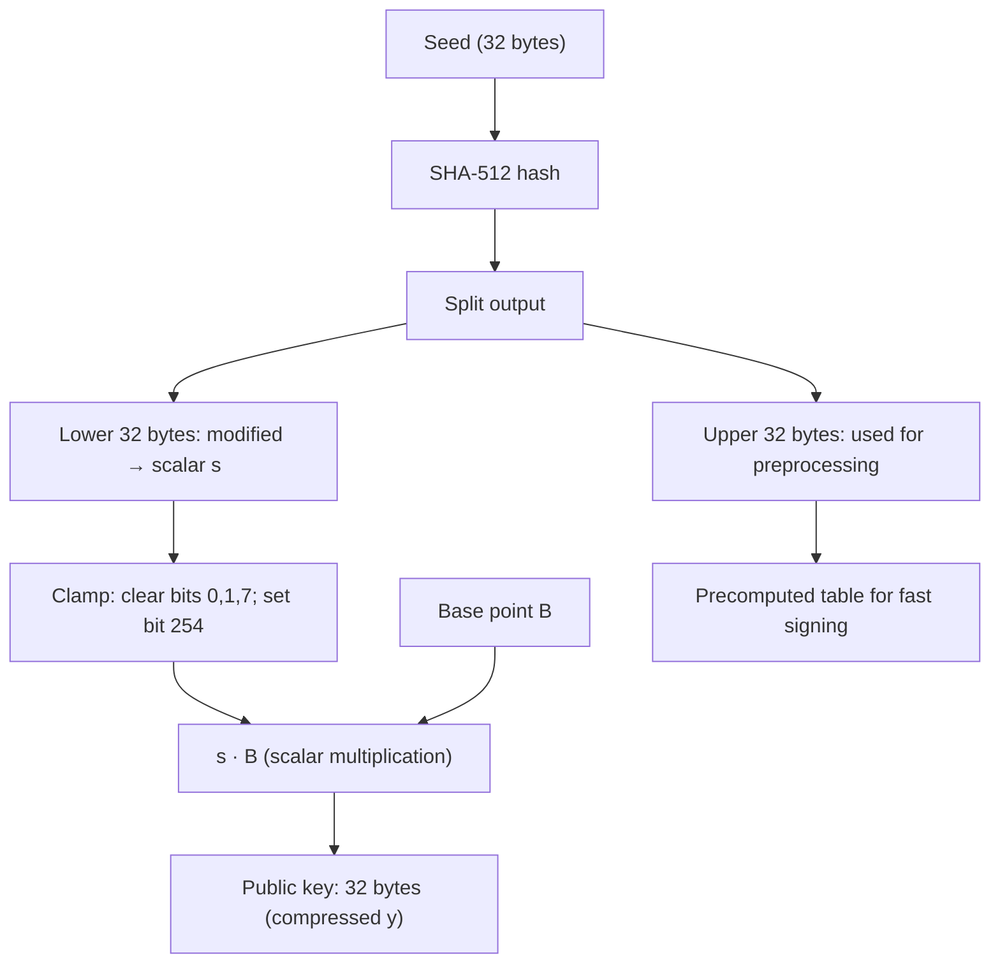

**Clamping** ensures the scalar is in the correct subgroup and resistant to small-subgroup attacks:
- Bits 0, 1, 3 of first byte → cleared (ensures high cofactor)
- Bit 7 of first byte → cleared
- Bit 6 of last byte → set (ensures point is on prime-order subgroup)

### Signing

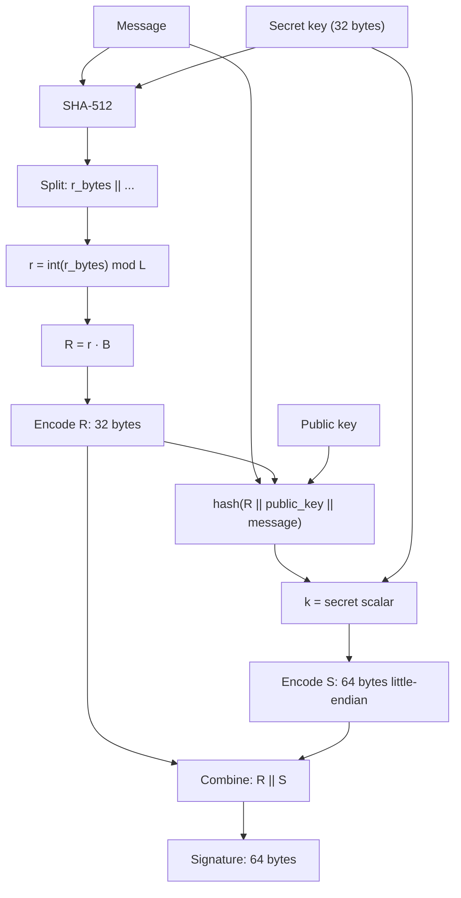

### Verification

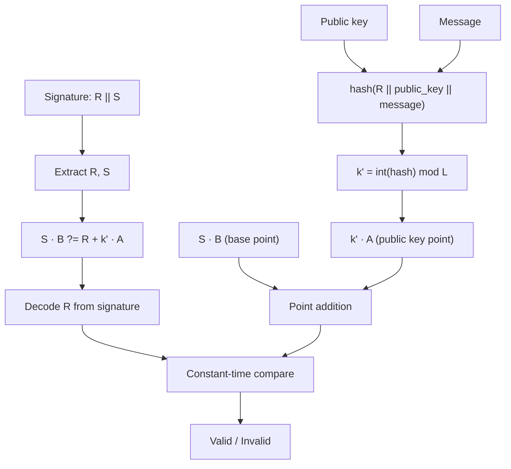

**Constant-time comparison** prevents timing attacks that could distinguish valid from invalid signatures based on which byte differs first.

---

## 5. WASM Binding Layer

### Architecture

The Rust crypto library is compiled to WebAssembly and exposed to JavaScript via `wasm-bindgen`. The frontend imports these bindings through a TypeScript wrapper.

```mermaid
graph TD
    subgraph Rust
        SC[send_crypto.rs]
        Seven[seven.rs]
    end

    subgraph WASM-Bindings
        SCW[send_crypto WASM]
        SevenW[seven WASM]
    end

    subgraph TypeScript
        CW[chithi_wasm.ts]
        Enc[encryption.ts]
        Str[streams.ts]
    end

    subgraph Workers
        EW[encrypt.worker.ts]
        DW[decrypt.worker.ts]
        SH[shared.ts]
    end

    SC --> SCW
    Seven --> SevenW
    SCW --> CW
    SevenW --> CW
    CW --> SH
    SH --> EW
    SH --> DW
    CW --> Enc
    CW --> Str
```

### WASM Function Exports

The `wasm_binding` crate exports these crypto functions to JavaScript:

| WASM Function | TypeScript Name | Purpose |
|---|---|---|
| `wasm_encrypt_chunk` | `wasmEncryptChunk` | AES-256-GCM encrypt single chunk |
| `wasm_decrypt_chunk` | `wasmDecryptChunk` | AES-256-GCM decrypt single chunk |
| `wasm_get_chunk_nonce` | `wasmGetChunkNonce` | Derive nonce from base IV + chunk index |
| `wasm_encrypt_record` | — | AES-256-CBC encrypt (legacy) |
| `wasm_decrypt_record` | — | AES-256-CBC decrypt (legacy) |
| `wasm_derive_key` | `wasmDeriveKey` | Argon2id key derivation |
| `wasm_generate_secret` | — | Generate random 32-byte secret |
| `WasmKeychain` | `WasmKeychain` | Keychain class with metadata/signing ops |

### WASM Initialization Flow

```mermaid
sequenceDiagram
    participant App as App Startup
    participant CW as chithi_wasm.ts
    participant WB as wasm-bindgen
    participant WASM as WASM Module

    App->>CW: ensureInitialized()
    CW->>WB: init()
    WB->>WASM: Download .wasm binary
    WASM->>WASM: Instantiate
    WB->>CW: Ready
    CW->>CW: Set initialized = true
    CW-->>App: Promise resolves
```

The `ensureInitialized()` function is idempotent — multiple callers share a single init promise, avoiding redundant WASM downloads.

### Memory Management

```mermaid
flowchart TD
    subgraph WASM-Linear-Memory
        Input["Input buffers: copied on call"]
        Output["Output buffers: allocated in WASM"]
        GC["Returned to JS as Uint8Array"]
    end

    Input --> Func["wasm_encrypt_chunk / wasm_decrypt_chunk"]
    Func --> Output
    Output --> GC
    GC --> JSFree["JavaScript GC reclaims on next cycle"]
```

WASM functions return new `Uint8Array` instances. The underlying WASM linear memory is copied to JS heap and the WASM allocation is freed automatically by `wasm-bindgen`.

---

## 6. Frontend Streaming Architecture

### Overview

The frontend encrypts/decrypts data as a streaming TransformStream, splitting input into 64 KB chunks and dispatching them to a worker pool for parallel processing.

```mermaid
flowchart LR
    subgraph Upload
        Input[ReadableStream<Uint8Array>]
        TS[TransformStream]
        Output[Encrypted ReadableStream]
    end

    Input --> TS
    TS --> Output

    subgraph TransformStream
        Split[Split into 64 KB chunks]
        Pool[Worker Pool]
        Order[Collect in order]
    end

    Split --> Pool
    Pool --> Order
```

### Worker Pool

```mermaid
flowchart TD
    subgraph Main-Thread
        Dispatch["Round-robin dispatch"]
        Collect["Ordered collection"]
    end

    subgraph Worker-0
        W0["wasmEncryptChunk"]
    end
    subgraph Worker-1
        W1["wasmEncryptChunk"]
    end
    subgraph Worker-2
        W2["wasmEncryptChunk"]
    end
    subgraph Worker-N
        WN["wasmEncryptChunk"]
    end

    Dispatch -->|"chunk 0"| W0
    Dispatch -->|"chunk 1"| W1
    Dispatch -->|"chunk 2"| W2
    Dispatch -->|"chunk 3"| WN
    Dispatch -->|"chunk 4"| W0
    Dispatch -->|"chunk 5"| W1

    W0 --> Collect
    W1 --> Collect
    W2 --> Collect
    WN --> Collect
```

Each worker:
1. Receives an `init` message with raw key bytes and base IV
2. Initializes WASM independently
3. Processes chunks via `wasmEncryptChunk(chunk, key, nonce)`
4. Returns result with chunk index for ordering

### Fallback Path

If all workers fail to initialize, the main thread falls back to synchronous WASM calls:

```mermaid
flowchart TD
    subgraph Main-Thread-Fallback
        Check["Workers available?"]
        Check -->|Yes| Pool["Dispatch to worker pool"]
        Check -->|No| Direct["Direct wasmEncryptChunk call"]
        Pool --> Collect["Collect results"]
        Direct --> Collect
    end
```

### Key Derivation in Frontend

```mermaid
flowchart TD
    subgraph deriveSecrets
        IKM["IKM (32 bytes)"]
        Password["Optional password"]
        XOR["XOR with password-derived bytes"]
        Argon2["argon2DeriveWasm"]
        SHA256_1["SHA-256(IKM + 'aes-key')"]
        SHA256_2["SHA-256(IKM + HKDF_IV_STR)"]
        HKDFSalt["HKDF salt (16 bytes)"]
        BaseIV["Base IV (12 bytes)"]
        KeyRaw["Raw key (32 bytes)"]
    end

    IKM --> Argon2
    Password -->|If set| XOR
    XOR --> SHA256_1
    SHA256_1 --> HKDFSalt
    SHA256_2 --> BaseIV
    IKM --> KeyRaw
    HKDFSalt --> KeyRaw
```

The frontend derives:
- **`keyRaw`**: 32-byte AES-256 key via `deriveAESKeyRaw(finalIKM, hkdfSalt)`
- **`baseIv`**: 12-byte base IV via SHA-256 of IKM + constant string
- **Password integration**: if password is set, IKM is XORed with Argon2-derived bytes before key/IV derivation

### Chunk Sizing

| Constant | Value | Purpose |
|---|---|---|
| `CHUNK_SIZE` | 65,536 bytes (64 KB) | Optimal for GCM tag overhead vs. parallelism |
| GCM Tag | 16 bytes | Auth tag appended to each chunk |
| Worker concurrency | Configurable | Default from `WORKER_CONCURRENCY` constant |

---

## 7. Complete Upload/Download Flow

### Upload

```mermaid
sequenceDiagram
    autonumber
    participant U as User
    participant C as Client
    participant S as Server

    U->>C: Select files + optional password
    C->>C: Generate random IKM (32 bytes)
    alt Password provided
        C->>C: XOR IKM with Argon2-derived password bytes
    end
    C->>C: deriveSecrets(IKM) → { keyRaw, baseIv }
    C->>C: ensureInitialized() — load WASM
    C->>C: Compress files → 7z archive stream
    C->>C: Split stream into 64 KB chunks
    C->>C: Worker pool: wasmEncryptChunk(chunk, keyRaw, getChunkNonce(baseIv, idx))
    C->>C: Collect encrypted chunks in order
    C->>S: Upload encrypted stream
    S->>S: Store ciphertext (no decryption possible)
    S->>C: Return upload ID
    C->>U: Share URL: https://host/download/{id}#{base64url(IKM)}
```

### Download

```mermaid
sequenceDiagram
    autonumber
    participant D as Downloader
    participant C as Client
    participant S as Server

    D->>C: Open URL with #fragment secret
    C->>C: Extract upload ID + IKM from URL
    C->>S: Fetch encrypted data by ID
    S->>C: Return encrypted stream
    C->>C: deriveSecrets(IKM) → { keyRaw, baseIv }
    C->>C: Worker pool: wasmDecryptChunk(chunk, keyRaw, getChunkNonce(baseIv, idx))
    C->>C: Collect decrypted chunks in order
    C->>C: Reassemble 7z archive
    C->>C: Decompress 7z archive
    C->>D: Present decrypted files
```

### Key Distribution

The secret travels only in the URL fragment (`#`), which browsers **never send to the server**:

```
https://example.com/download/abc123#base64url_ikm
     ^-- server sees this              ^-- only client sees this
```

---

## 8. Threat Model

```mermaid
flowchart TD
    subgraph Trusted
        U["User / Client"]
        Crypto["Crypto libraries (Rust/WASM)"]
    end

    subgraph Untrusted
        S["Server"]
        Net["Network"]
    end

    U -->|Ciphertext only| S
    U -->|Ciphertext only| Net
    S -->|Ciphertext only| Net
    Net -->|Ciphertext only| U

    style S fill:#f99
    style Net fill:#f99
    style U fill:#9f9
    style Crypto fill:#9f9
```

| Threat | Mitigation |
|---|---|
| Server compromise | Server only holds ciphertext; secrets never transmitted to server |
| Network eavesdropping | All data encrypted in transit; keys derived client-side |
| Metadata leakage | Metadata encrypted with ChaCha20-Poly1305 (filenames, sizes) |
| Replay attacks | Per-upload random salts, nonces, IVs ensure unique ciphertexts |
| Tampering | **AES-256-GCM auth tag per chunk**; Ed25519 signatures on payload; Poly1305 MAC on metadata |
| Brute-force password | Argon2id with 64 KiB memory cost + 8 iterations slows guessing |
| Side-channel (WASM) | ChaCha20 uses constant-time integer arithmetic; GCM uses constant-time GHASH |
| Chunk reordering | GCM tag verification rejects any modified chunk; ordered collection ensures correct reassembly |

---

## 9. Parameter Summary

```mermaid
erdiagram
    PARAMETERS {
        "KEY_DERIVATION_MEMORY" : u32 "64 * 1024"
        "KEY_DERIVATION_ITERATIONS" : u32 "8"
        "KEY_DERIVATION_PARALLELISM" : u32 "1"
        "KEY_DERIVATION_LENGTH" : usize "32"
        "CHUNK_SIZE" : usize "65536 (64 KB)"
        "GCM_TAG_LENGTH" : usize "16"
        "NONCE_LENGTH" : usize "12"
        "SALT_LENGTH" : usize "32"
        "SIGNING_KEY_LENGTH" : usize "32"
        "AUTH_KEY_LENGTH" : usize "32"
        "MAX_CONTENT_LENGTH" : usize "100 MB"
        "MAX_FILE_COUNT" : usize "100"
        "MAX_METADATA_LENGTH" : usize "10 KB"
    }
```

---

## 10. Data Structures

### Keychain

```mermaid
classDiagram
    class Keychain {
        -ikm: [u8; 32]
        -salt: [u8; 32]
        -secret: [u8; 32]
        -signing_key: SigningKey
        -auth_key: [u8; 32]
        +new() Keychain
        +from_password(password: str) Keychain
        +generate_secret() String
        +encrypt_metadata(metadata: str) Vec~u8~
        +decrypt_metadata(data: Vec~u8~) String
        +sign(data: Vec~u8~) Vec~u8~
        +verify(data: Vec~u8~, signature: Vec~u8~) bool
        +set_password(password: str) void
        +export_auth_key() Vec~u8~
        +salt() Vec~u8~
        +ikm() Vec~u8~
    }
    class Metadata {
        +filesize: u64
        +filename: String
        +filetype: String
    }
    Keychain --> Metadata : "encrypts/decrypts"
```

### Encrypted Chunk Format (AES-256-GCM)

```
┌─────────────────────────────────────────────────────────────┐
│ Ciphertext (variable, no padding needed)                    │
├─────────────────────────────────────────────────────────────┤
│ GCM Auth Tag (16 bytes)                                     │
└─────────────────────────────────────────────────────────────┘
```

Total per chunk: `plaintext_length + 16` bytes (GCM tag only, no padding)

### Encrypted Metadata Format

```
┌─────────────────────────────────────────────────────────────┐
│ Nonce (12 bytes)                                            │
├─────────────────────────────────────────────────────────────┤
│ ChaCha20-Poly1305 ciphertext (variable)                     │
├─────────────────────────────────────────────────────────────┤
│ Poly1305 tag (16 bytes)                                     │
└─────────────────────────────────────────────────────────────┘
```

### CBC Legacy Record Format (deprecated)

```
┌─────────────────────────────────────────────────────────────┐
│ IV (16 bytes)                                               │
├─────────────────────────────────────────────────────────────┤
│ AES-256-CBC ciphertext (N × 16 bytes, N ≥ 1)               │
│ (includes PKCS7 padding)                                    │
└─────────────────────────────────────────────────────────────┘
```

---

## 11. Crate Dependencies

```mermaid
graph TD
    subgraph Workspace
        Core[chithi-core]
        WASM[chithi-core-wasm]
        Py[chithi-core-py]
    end

    subgraph Crypto
        Argon2[argon2 0.5]
        HKDF[hkdf 0.12]
        SHA2[sha2 0.10]
        ChaCha[chacha20poly1305 0.10]
        AES[aes 0.8]
        AESGCM[aes-gcm 0.10]
        CBC[cbc 0.1]
        Ed25519[ed25519-dalek 2]
    end

    subgraph Util
        Base64[base64 0.22]
        Rand[rand 0.8]
        Cipher[cipher 0.4]
        Rayon[rayon 1.10]
    end

    subgraph WASM-Toolchain
        WB[wasm-bindgen 0.2]
        JS[js-sys 0.3]
        GetR[getrandom 0.2]
    end

    Core --> Argon2
    Core --> HKDF
    Core --> SHA2
    Core --> ChaCha
    Core --> AES
    Core --> AESGCM
    Core --> CBC
    Core --> Ed25519
    Core --> Base64
    Core --> Rand
    Core --> Cipher
    Core --> Rayon

    WASM --> Core
    WASM --> WB
    WASM --> JS
    WASM --> GetR

    Py --> Core
    Py --> PyO3[pyo3 0.22]
```

---

## 12. Cross-Platform Consistency

### Unified Crypto Path

All platforms — Rust native, Python bindings, and WASM — use the **same Rust crypto code**. The frontend worker pool calls WASM functions that are thin wrappers around the same `encrypt_chunk`/`decrypt_chunk` functions used by the Rust core and Python bindings.

```mermaid
flowchart TD
    subgraph Single-Source-of-Truth
        SC[send_crypto.rs]
    end

    SC -->|Compile| Rust["Rust native binary"]
    SC -->|wasm-bindgen| WASM["WASM module"]
    SC -->|pyo3| Py["Python extension"]

    Rust -->|encrypt_chunk| RResult["Identical output"]
    WASM -->|wasm_encrypt_chunk| WResult["Identical output"]
    Py -->|encrypt_chunk| PResult["Identical output"]
```

### Verification

Data encrypted on any platform can be decrypted on any other:
- **Frontend encrypts** → Rust/Python decrypts
- **Python encrypts** → Frontend decrypts
- **Rust encrypts** → Frontend/Python decrypts

This is guaranteed because:
1. Same AES-256-GCM implementation
2. Same nonce derivation (`get_chunk_nonce`)
3. Same key derivation (`argon2DeriveWasm` / `argon2_derive`)
4. Same chunk size (64 KB)

---

## 13. Performance Considerations

### AES-GCM vs ChaCha20-Poly1305 in WASM

| Factor | AES-GCM | ChaCha20-Poly1305 |
|---|---|---|
| WASM performance | Depends on AES-NI in host | Consistent integer arithmetic |
| Auth tag | 16 bytes (built-in) | 16 bytes (built-in) |
| Padding | None | None |
| Parallelism | Per-chunk (nonce from index) | Per-chunk (unique nonce) |

AES-GCM is chosen for content encryption because:
- Modern browsers optimize WASM AES instructions via WasmSIMD
- GCM tag provides stronger integrity guarantees than CBC padding
- No padding means slightly less overhead per chunk

### Worker Pool Sizing

The `WORKER_CONCURRENCY` constant controls parallelism:

```mermaid
flowchart LR
    subgraph Optimal-Sizing
        CPU["CPU cores"] --> Min["min(cores, WORKER_CONCURRENCY)"]
        Min --> Workers["Active workers"]
    end
```

Typical values:
- **Desktop**: 4-8 workers (matches CPU cores)
- **Mobile**: 2-4 workers (battery-conscious)
- **WASM Rayon**: inherits from `init_rayon()` call

### Memory Usage

```mermaid
flowchart TD
    subgraph Per-Worker
        WASM["WASM module (~200 KB)"]
        Key["Key bytes (32 B)"]
        BaseIV["Base IV (12 B)"]
        Chunk["Chunk buffer (64 KB)"]
    end
    Workers["N workers"]
    Workers --> WASM
    Workers --> Key
    Workers --> BaseIV
    Workers --> Chunk
```

Total memory per worker: ~64 KB (chunk) + ~200 KB (WASM) = ~264 KB. With 8 workers: ~2 MB total.

---

## 14. Testing Strategy

### Rust Unit Tests

```mermaid
graph TD
    subgraph send_crypto.rs
        T1[test_get_chunk_nonce]
        T2[test_encrypt_decrypt_chunk_gcm]
        T3[test_encrypt_decrypt_chunk_empty]
        T4[test_encrypt_decrypt_chunks_parallel]
        T5[test_encrypt_decrypt_record]
        T6[test_encrypt_decrypt_all]
        T7[test_pad_unpad]
        T8[test_keychain_new]
        T9[test_derive_key]
        T10[test_sign_verify]
        T11[test_keychain_from_password]
        T12[test_encrypt_decrypt_metadata]
    end
```

### Frontend Tests

| Test Suite | Scope | Environment |
|---|---|---|
| `encryption.client.test.ts` | Argon2id key derivation | Browser (Playwright) |
| `streams.client.test.ts` | ZIP + stream encryption roundtrip | Browser (Playwright) |
| `encryption.test.ts` | Key derivation, base64 encoding | Node.js (server) |
| `streams.test.ts` | Stream creation, multipart | Node.js (server) |
| `chithi_core.client.test.ts` | WASM Argon2 + 7z roundtrip | Browser (Playwright) |

### Cross-Validation

Data encrypted by the frontend must be decryptable by the Rust core and Python bindings, verified through integration tests that:
1. Generate random data in Rust
2. Encrypt via WASM from JavaScript
3. Decrypt via Rust core
4. Verify plaintext matches
